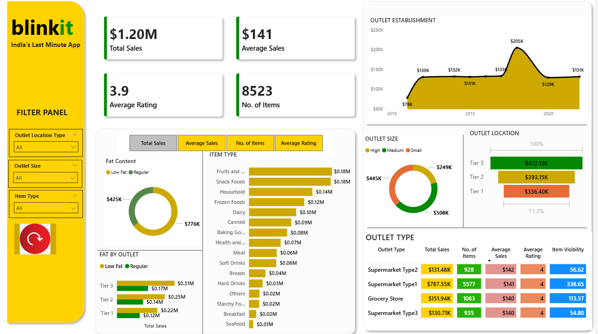

## Overview  
This project presents an interactive Power Bi Dashboard analysing Blinkit grocery sales performance, Outlet distribution, item categories and customer rating. This dashboard helps stakeholders understand sales performance, Outlet performance and product insights for better decision making.

## Key Metrics  
 - Total Sales
 - Average Sales
 - No. of items
 - Average Rating

## Tools Used  
- Power Bi desktop
- DAX
- Data Visualization techniques

## Screenshots  

## Live Dashboard  
<iframe title="Blinkit" width="600" height="373.5" src="https://app.fabric.microsoft.com/view?r=eyJrIjoiYWUyMjFiMjEtMzgzNC00NjViLTliZTktZjY5ZDNiZjk1Mzg0IiwidCI6ImE0MmRjZTc5LTI2ZTktNDNiZC05MjFjLTY0OGUwZTYxYjAyMCJ9" frameborder="0" allowFullScreen="true"></iframe>
